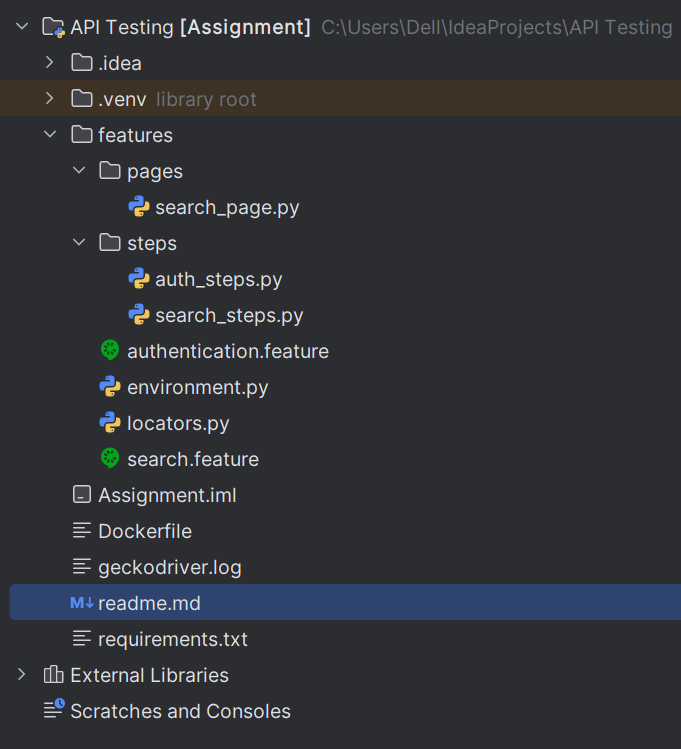

# QA Automation Assignment

This project is a complete QA automation framework that includes both API and UI testing, built using Python and containerized with Docker.

---

## Contents of This Project (ZIP Package)

This ZIP file contains:

- API test scenarios (DummyJSON authentication API)
- UI test scenarios (SDAIA website search)
- Dockerfile for running tests in a container
- Configuration file samples
- A README file with instructions

---

## Technologies Used

- **Language**: Python 3.11
- **BDD Framework**: Behave
- **API Testing**: Requests
- **UI Testing**: Playwright
- **Containerization**: Docker

---

## Folder Structure

## Install dependencies:
`pip install -r requirements.txt
python -m playwright install`

## Run the tests:

### Run all tests:

`behave`

### Run only API tests:

`behave features/authentication.feature`

### Run only UI tests:

`behave features/search.feature`
## Challenges Faced

#### Learning Python & Playwright:
This was my first time using both, as mentioned in the interview. I had to quickly learn how to structure BDD tests with Behave and use Playwright for browser automation.

#### Docker & WSL2 Issues on Windows:
I ran into problems getting Docker to run properly due to WSL update failures and network restrictions, so I ran the tests locally instead.

#### Switch from Selenium to Playwright:
Initially set up with Selenium, but switched to Playwright due to Geckodriver and PATH issues. This required rewriting UI test logic.

#### Playwright Lifecycle Errors:
Faced “event loop is closed” errors when using Playwright with Behave. Fixed by properly managing the browser/context setup and teardown.

#### Arabic Text & Input Validation:
Some UI tests included Arabic and XSS cases, which needed careful handling of encoding and DOM checks.
